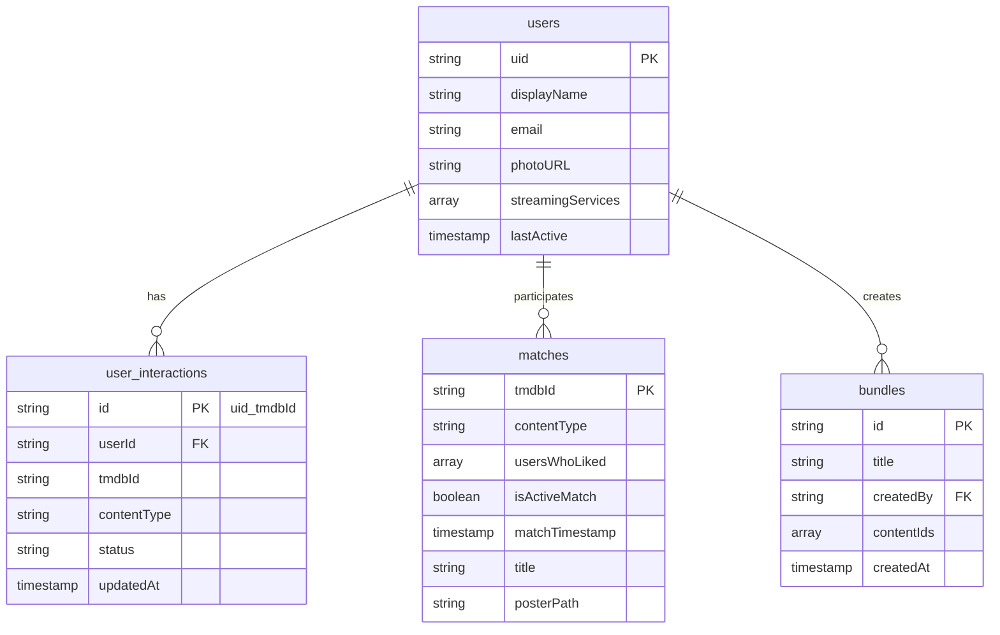

# Firestore Schema - The Shared Screen

This document defines the Firestore database structure for "The Shared Screen" application.

---

## Collections Overview



---

## 1. `users` Collection

Stores user profiles and preferences.

| Field | Type | Description |
|-------|------|-------------|
| `displayName` | `string` | User's display name |
| `email` | `string` | User's email address |
| `photoURL` | `string` | Profile photo URL |
| `streamingServices` | `string[]` | Subscribed services (e.g., `['netflix', 'max', 'hulu']`) |
| `lastActive` | `Timestamp` | Last activity timestamp |

**Document ID**: Firebase Auth `uid`

### Example Document
```json
{
  "displayName": "Jane Doe",
  "email": "jane@example.com",
  "photoURL": "https://...",
  "streamingServices": ["netflix", "max", "disney_plus"],
  "lastActive": "2026-01-05T20:00:00Z"
}
```

---

## 2. `user_interactions` Collection

Tracks individual user preferences for movies and TV shows.

| Field | Type | Description |
|-------|------|-------------|
| `userId` | `string` | Reference to user's `uid` |
| `tmdbId` | `string` | TMDB content ID |
| `contentType` | `string` | `'movie'` or `'tv'` |
| `status` | `string` | `'liked'`, `'Yes'`, `'No'`, `'watched'`, `'wont_watch'`, `'not_important'` |
| `updatedAt` | `Timestamp` | Last update time (server-managed) |

**Document ID**: `{uid}_{tmdbId}` (composite key)

### Example Document
```json
{
  "userId": "abc123",
  "tmdbId": "550",
  "contentType": "movie",
  "status": "Yes",
  "updatedAt": "2026-01-05T19:30:00Z"
}
```

---

## 3. `matches` Collection

Generated when two users both mark a title as "Yes".

| Field | Type | Description |
|-------|------|-------------|
| `tmdbId` | `string` | TMDB content ID |
| `contentType` | `string` | `'movie'` or `'tv'` |
| `usersWhoLiked` | `string[]` | Array of user UIDs |
| `isActiveMatch` | `boolean` | `true` when `usersWhoLiked.length === 2` |
| `matchTimestamp` | `Timestamp` | When match became active |
| `title` | `string` | _(Optional)_ Cached title |
| `posterPath` | `string` | _(Optional)_ Cached poster path |

**Document ID**: `tmdbId`

### Example Document
```json
{
  "tmdbId": "550",
  "contentType": "movie",
  "usersWhoLiked": ["uid1", "uid2"],
  "isActiveMatch": true,
  "matchTimestamp": "2026-01-05T20:15:00Z",
  "title": "Fight Club",
  "posterPath": "/pB8BM7pdSp6B6Ih7QZ4DrQ3PmJK.jpg"
}
```

---

## 4. `bundles` Collection

Curated content lists created by users.

| Field | Type | Description |
|-------|------|-------------|
| `title` | `string` | Bundle name (e.g., "Friday Night Romcoms") |
| `createdBy` | `string` | Creator's `uid` |
| `contentIds` | `string[]` | Array of TMDB IDs |
| `createdAt` | `Timestamp` | Creation time (server-managed) |

**Document ID**: Auto-generated

### Example Document
```json
{
  "title": "Friday Night Romcoms",
  "createdBy": "abc123",
  "contentIds": ["27205", "313369", "508442"],
  "createdAt": "2026-01-04T18:00:00Z"
}
```

---

## Indexes

### Required Composite Indexes

| Collection | Fields | Query Use Case |
|------------|--------|----------------|
| `user_interactions` | `userId` ASC, `updatedAt` DESC | Get user's recent interactions |
| `user_interactions` | `userId` ASC, `status` ASC | Filter by status |
| `matches` | `isActiveMatch` ASC, `matchTimestamp` DESC | Get active matches sorted by recency |
| `bundles` | `createdBy` ASC, `createdAt` DESC | Get user's bundles sorted by date |
